# EEG-Based Cognitive Load Detection Using Heterogeneous Graph Neural Networks

[](https://python.org)
[](https://pytorch.org)
[](https://pyg.org)
[](LICENSE)

**Master's Thesis** — Mohammad Amin Hosseinnia  
Supervisor: Dr. Elham Akhoundzadeh  
Tarbiat Modares University, Faculty of Industrial Engineering  
Department of Information Technology Engineering — 2025

---

## Overview

This repository contains the full implementation of a graph neural network 
framework for EEG-based cognitive load detection during mental arithmetic tasks.

The key contribution is a **heterogeneous multi-relational graph representation** 
of EEG signals that simultaneously encodes three types of relationships between 
EEG sub-windows: temporal continuity, spatial channel connectivity, and signal 
similarity across time.

---

## Pipeline

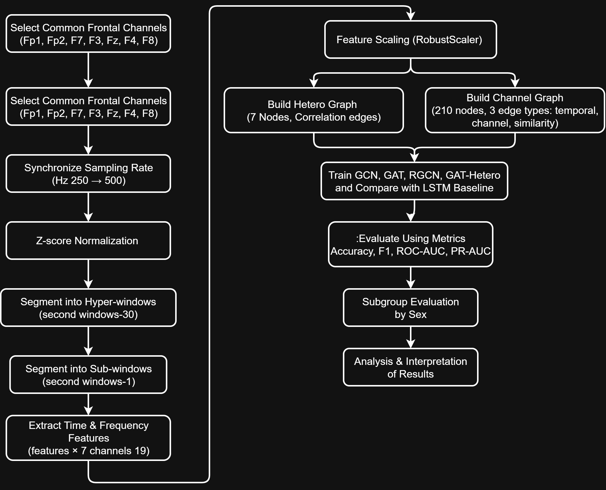
> **Figure 1** — Full research pipeline: from raw EEG to graph construction, 
> model training, evaluation, and fairness analysis.

---

## Datasets

This project uses two publicly available EEG datasets:

| Dataset | Subjects | Recordings | Task | Sampling Rate |
|---------|----------|------------|------|---------------|
| [EEGMAT](https://physionet.org/content/eegmat/1.0.0/) — Zyma et al. (2019) | 36 | 72 | Rest vs. Mental Arithmetic | 500 Hz → 250 Hz |
| [Cognitive Load EEG](https://data.mendeley.com/datasets/kt38js3jv7/1) — Nirabi et al. (2025) | 15 | 60 | Arithmetic (4 levels) | 250 Hz |
| **Combined** | **51** | **132** | Binary: Rest vs. Load | **250 Hz** |
| **After Windowing** | — | **447 hyper-windows** | 30s segments | 250 Hz |

> ⚠️ Datasets are not included due to size. Download from the links above 
> and place in a `data/` folder as described in [Usage](#usage).

---

## Signal Representation

### Raw EEG Signal
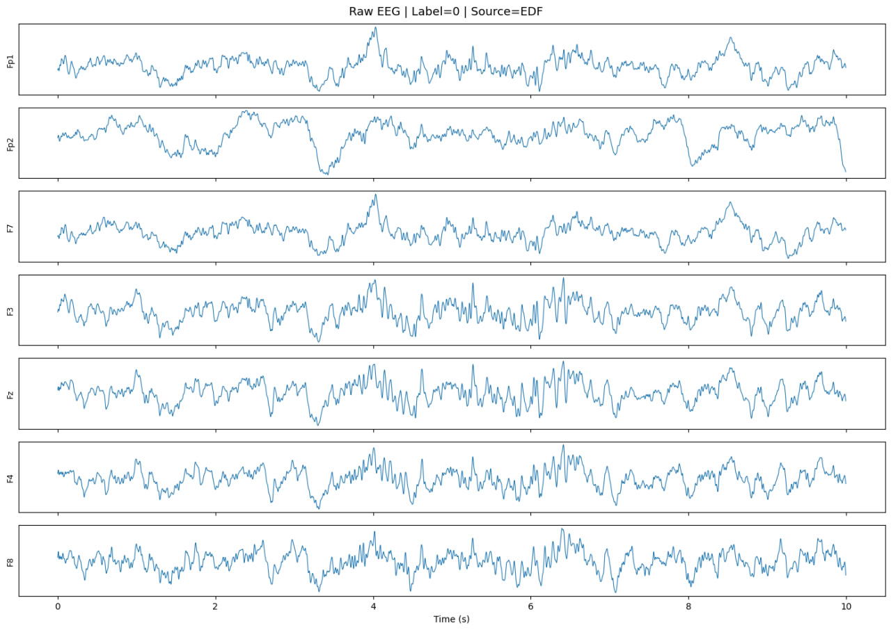
> **Figure 4** — Sample raw EEG recording across 7 frontal channels 
> (Fp1, Fp2, F7, F3, Fz, F4, F8) before any processing.

### Windowing Strategy
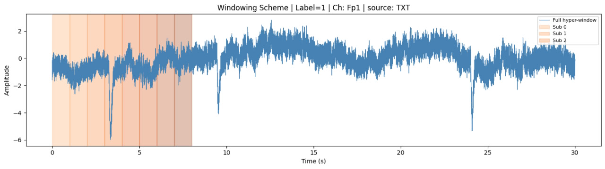
> **Figure 5** — Each recording is divided into 30-second hyper-windows, 
> then each hyper-window is subdivided into 1-second sub-windows. 
> The shaded regions show the first few sub-windows within one hyper-window.

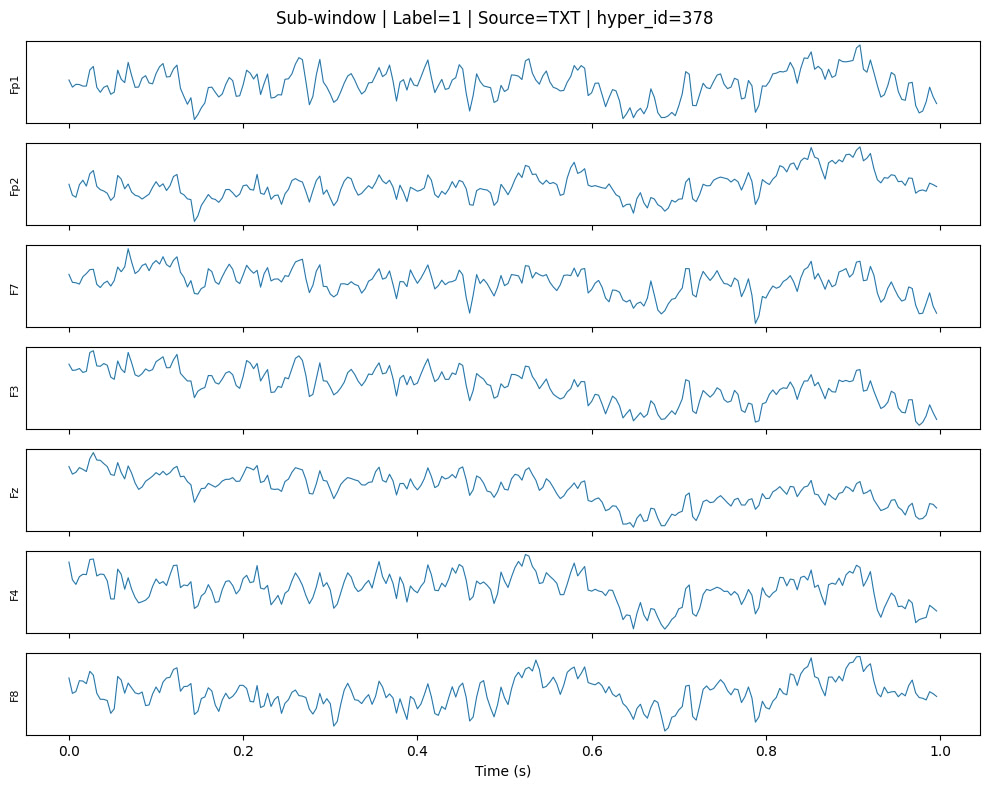
> **Figure 6** — A single 1-second sub-window across all 7 channels. 
> Each sub-window becomes one node in the heterogeneous graph.

---

## Graph Representations

Two graph types were designed and compared:

### 1. Channel Graph
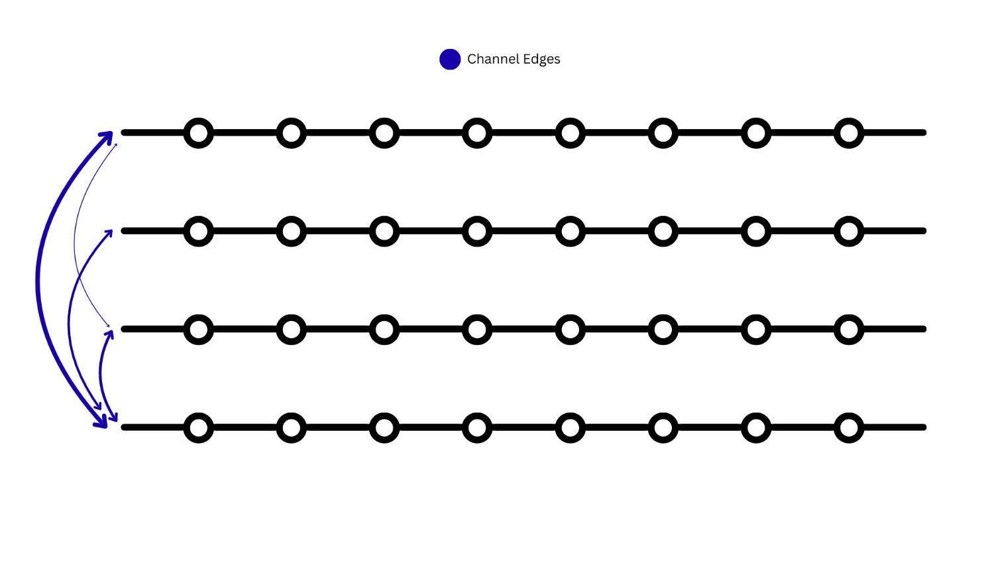
> **Figure 2** — In the channel graph, each EEG channel is one node (7 nodes total). 
> Edges connect channels whose Pearson correlation exceeds 0.3.

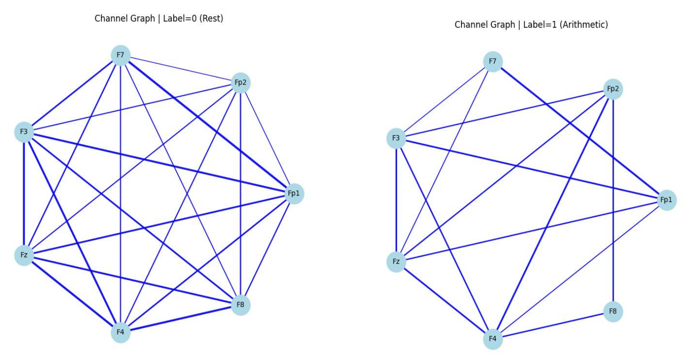
> **Figure 8** — Channel graph instances for Rest (left) and Arithmetic (right) classes. 
> Edge density and connectivity patterns differ between cognitive states.

### 2. Heterogeneous Multi-Relational Graph
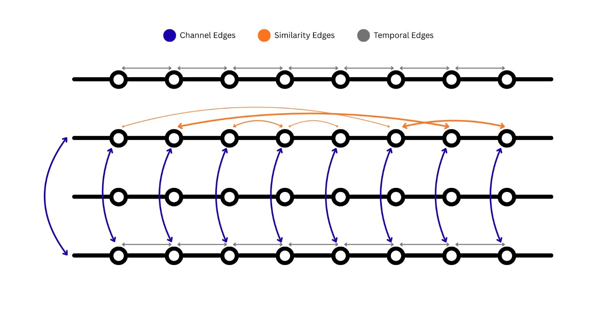
> **Figure 3** — The heterogeneous graph has 210 nodes (7 channels × 30 sub-windows). 
> Three edge types are defined: **temporal** (gray, t→t+1 within a channel), 
> **channel** (blue, correlated channels at the same timestep), and 
> **similarity** (orange, recurring signal patterns across time).

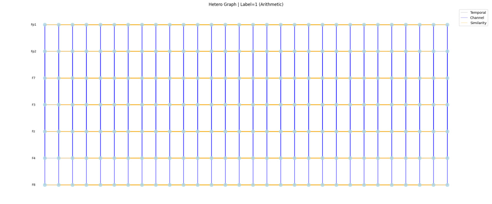
> **Figure 7** — A rendered instance of the heterogeneous graph for one 
> 30-second window. Rows represent channels, columns represent time steps.

---

## Models

Five models were trained and compared:

| Model | Graph Type | Architecture |
|-------|-----------|--------------|
| GCN | Channel Graph | 2-layer Graph Convolutional Network |
| GAT | Channel Graph | 2-layer Graph Attention Network (4 heads) |
| RGCN | Hetero Graph | 2-layer Relational GCN (3 relation types) |
| GAT-Hetero | Hetero Graph | 2-layer Graph Attention Network |
| LSTM | Raw Signals | 2-layer LSTM (baseline) |

---

## Results

### Overall Performance

| Model | Accuracy | Precision | Recall | F1 Score | ROC-AUC | PR-AUC |
|-------|----------|-----------|--------|----------|---------|--------|
| GCN — Channel | 0.8261 | 0.8696 | 0.6897 | 0.7692 | 0.8724 | 0.8700 |
| GAT — Channel | 0.7971 | 0.7778 | 0.7241 | 0.7500 | 0.9060 | 0.8998 |
| RGCN — Hetero | **0.8551** | 0.8800 | 0.7586 | **0.8148** | 0.9112 | 0.8830 |
| GAT — Hetero  | 0.8406 | **0.9091** | 0.6897 | 0.7843 | **0.9267** | **0.9093** |
| LSTM — Baseline | 0.7353 | 0.6786 | 0.6786 | 0.6786 | 0.7259 | 0.6472 |

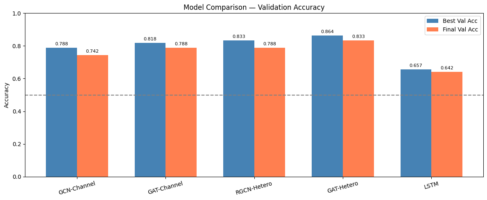
> **Figure 9** — Validation accuracy comparison across all models. 
> Blue = best val accuracy, Orange = final val accuracy. 
> Hetero graph models consistently outperform channel graph and LSTM baseline.

### Training Dynamics

The plots below show the full training history of each model. Although training continued until early stopping triggered, the model weights were automatically saved at the epoch with the best validation performance — just before overfitting began to develop. The reported test results therefore reflect the best generalizing checkpoint, not the final epoch.

<table>
<tr>
<td>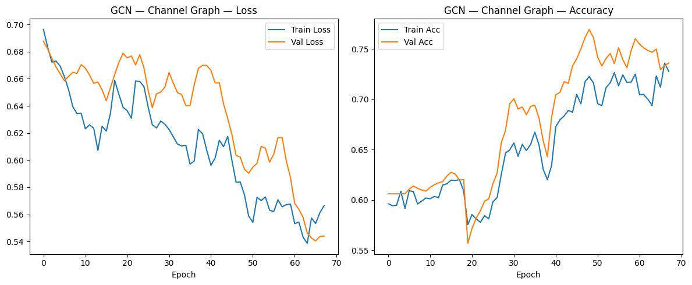</td>
<td>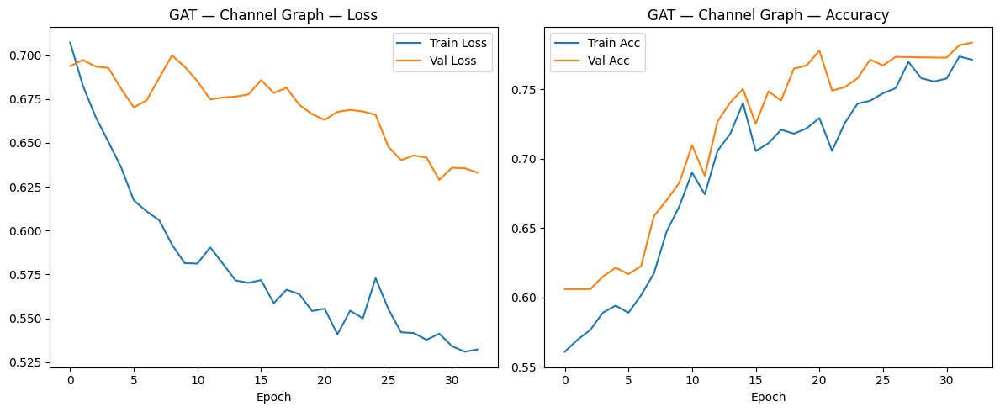</td>
</tr>
<tr>
<td align="center"><b>Figure 10</b> — GCN on Channel Graph</td>
<td align="center"><b>Figure 11</b> — GAT on Channel Graph</td>
</tr>
<tr>
<td>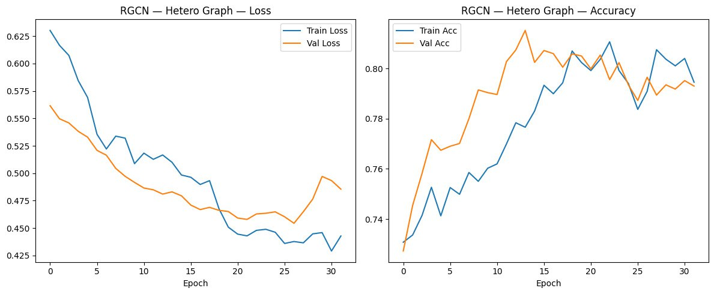</td>
<td>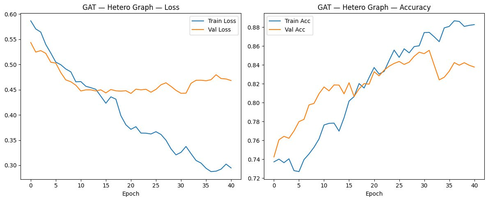</td>
</tr>
<tr>
<td align="center"><b>Figure 12</b> — RGCN on Hetero Graph</td>
<td align="center"><b>Figure 13</b> — GAT on Hetero Graph</td>
</tr>
</table>

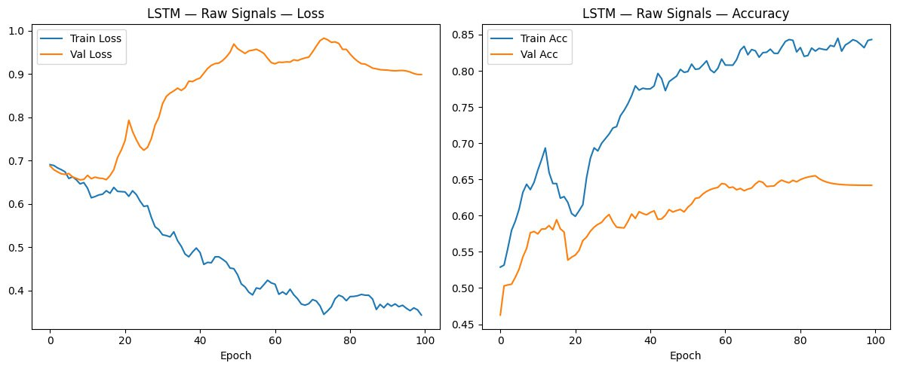
> **Figure 14** — LSTM baseline training on raw EEG signals. 
> Val accuracy plateaus around 65%, well below graph-based models.

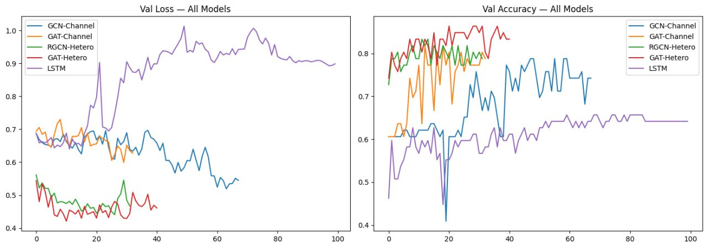
> **Figure 15** — Validation loss and accuracy for all 5 models overlaid. 
> Hetero graph models converge faster and to better values.

### Confusion Matrices

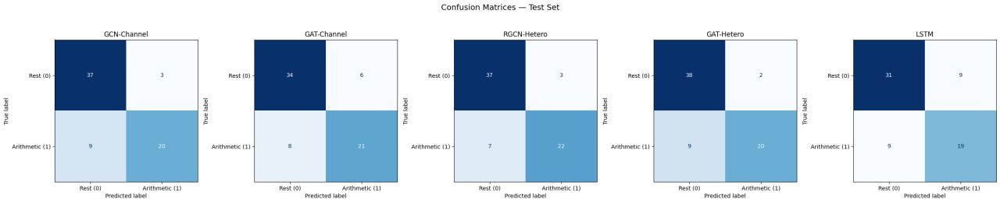
> **Figure 16** — Confusion matrices on the test set for all five models. 
> RGCN-Hetero achieves the best balance between true positives and false negatives.

### ROC and Precision-Recall Curves

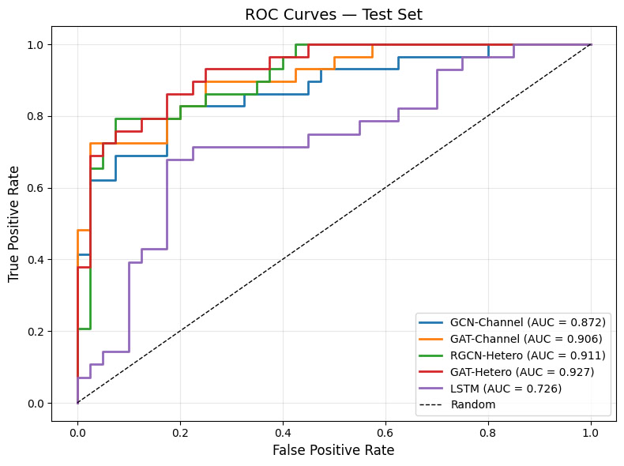
> **Figure 17** — ROC curves for all models. GAT-Hetero achieves the highest 
> AUC of 0.927, followed closely by RGCN-Hetero at 0.911. 
> LSTM (AUC=0.726) is far below all graph-based models.

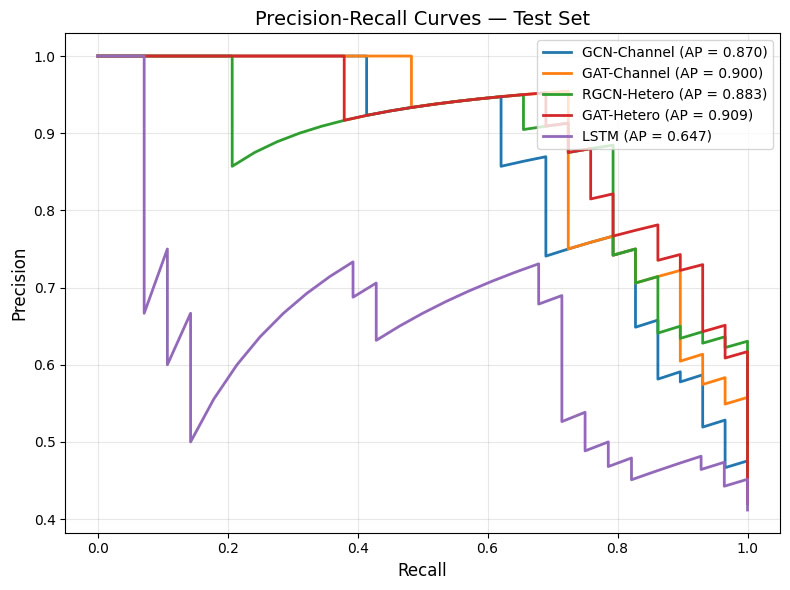
> **Figure 18** — Precision-Recall curves. GAT-Hetero leads with AP=0.909. 
> The steep drop in LSTM's PR curve highlights its poor robustness under 
> threshold variation.

---

## Fairness Analysis

Model performance was evaluated separately for male and female subjects 
to assess demographic robustness.

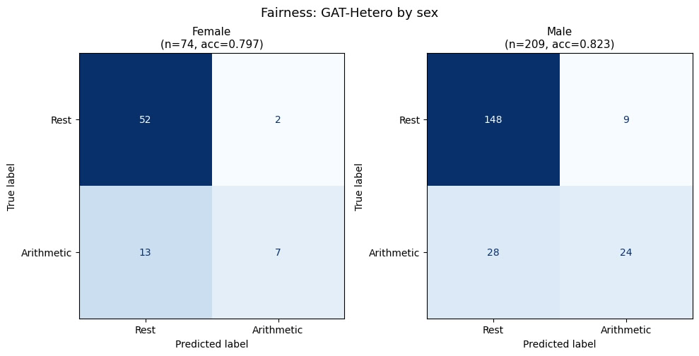
> **Figure 19** — Confusion matrices for GAT-Hetero on female (n=74, acc=0.797) 
> and male (n=209, acc=0.823) subgroups. Error patterns are consistent 
> across both groups, indicating no gender-specific bias.

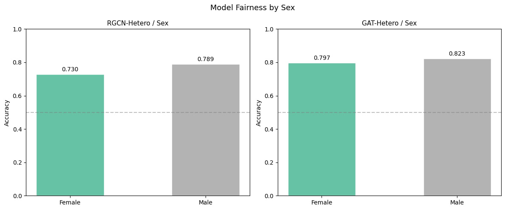
> **Figure 20** — Accuracy comparison by sex for RGCN-Hetero and GAT-Hetero. 
> The accuracy gap between male and female subgroups is 3–6%, 
> attributable to dataset imbalance rather than model bias.

---

## Installation

```bash
git clone https://github.com/YOUR_USERNAME/eeg-gnn-cognitive-load.git
cd eeg-gnn-cognitive-load
pip install -r requirements.txt
```

## Usage

Open `notebooks/eeg_gnn_thesis.ipynb` in Google Colab.  
Update the dataset paths in Section 2:

```python
edf_path = "/your/path/to/EEGMAT"
txt_path = "/your/path/to/CognitiveLoadEEG/Arithmetic_Data"
```

---

## Citation

```bibtex
@mastersthesis{hosseinnia2025eeg,
  author  = {Hosseinnia, Mohammad Amin},
  title   = {EEG-Based Cognitive Load Detection Using Heterogeneous 
             Graph Neural Networks},
  school  = {Tarbiat Modares University},
  year    = {2025},
  advisor = {Akhoundzadeh, Elham}
}
```

```bibtex
@article{zyma2019electroencephalograms,
  author  = {Zyma, Igor and Tukaev, Sergii and Seleznov, Ivan and 
             Kiyono, Ken and Popov, Anton and Chernykh, Mariia and 
             Shpenkov, Oleksii},
  title   = {Electroencephalograms during mental arithmetic task performance},
  journal = {Data},
  volume  = {4},
  number  = {1},
  pages   = {14},
  year    = {2019}
}
```

```bibtex
@article{nirabi2025cognitive,
  author  = {Nirabi, Ali and others},
  title   = {Cognitive load assessment through EEG: A dataset from 
             arithmetic and Stroop tasks},
  journal = {Data in Brief},
  volume  = {60},
  pages   = {111477},
  year    = {2025}
}
```

## License

MIT License — see [LICENSE](LICENSE) for details.
